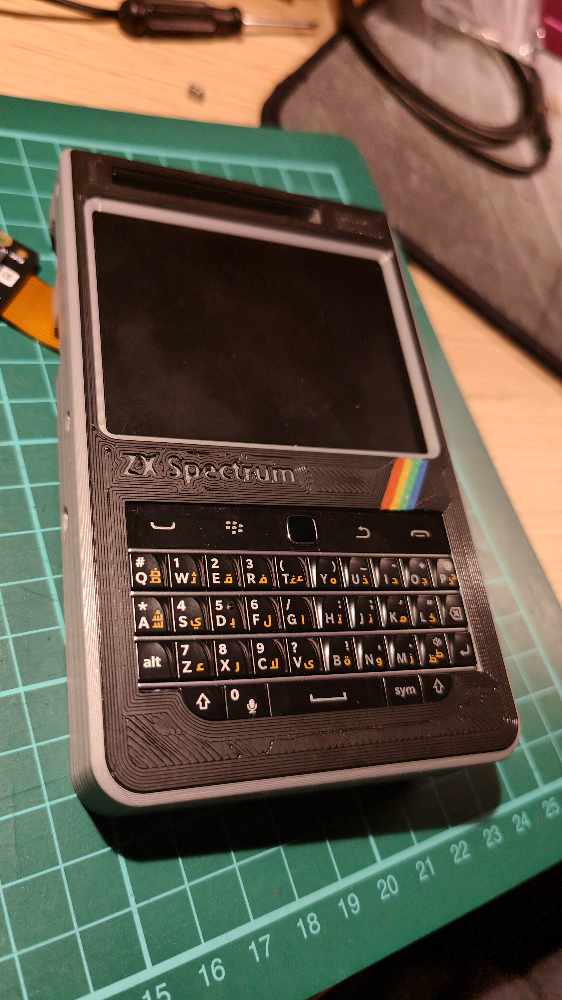

## Repository for sharing my Blackberry Pi handheld computer project

Thanks to Tom Nardi, David Crookes and other tech magazine journalists, this project has been featured in [Hackaday](https://hackaday.com/2023/08/12/blackberry-pi-puts-desktop-linux-in-your-pocket/ "Blackberry Pi Puts Desktop Linux In Your Pocket") and the [issue 135 of official Raspberry Pi magazine Magpi](https://magpi.raspberrypi.com/articles/blackberry-pi "Blackberry Pi")

For detailed build log, BOM and future plans, please refer to [my Blackberry Pi blog page](https://zxmake.dev/2023/08/05/blackberry-pi/https://zxmake.dev/2023/08/05/blackberry-pi/ "Blackberry Pi build log").

